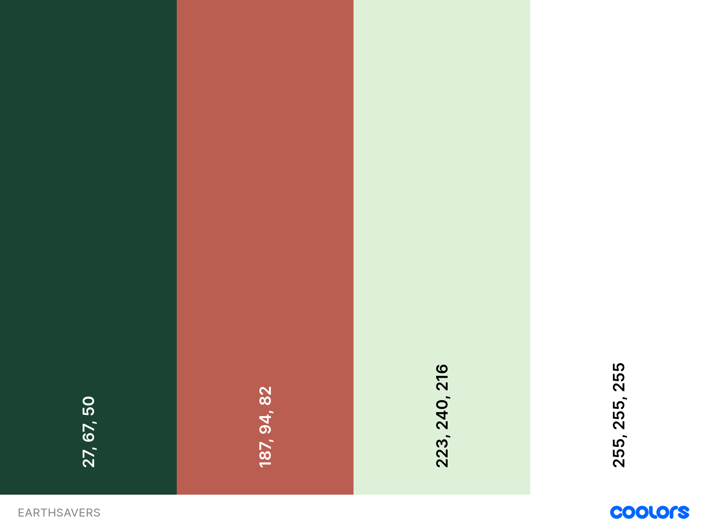
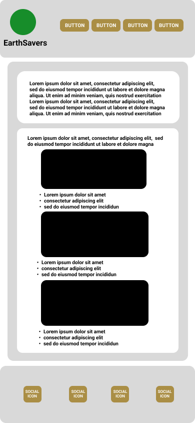
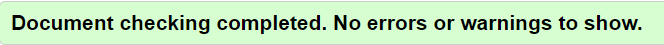
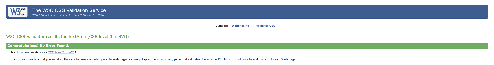
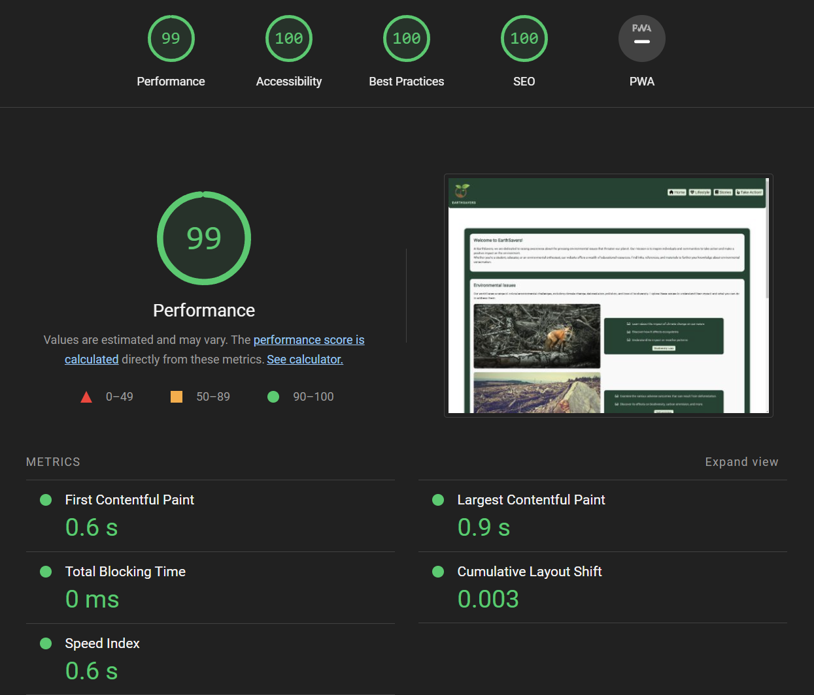
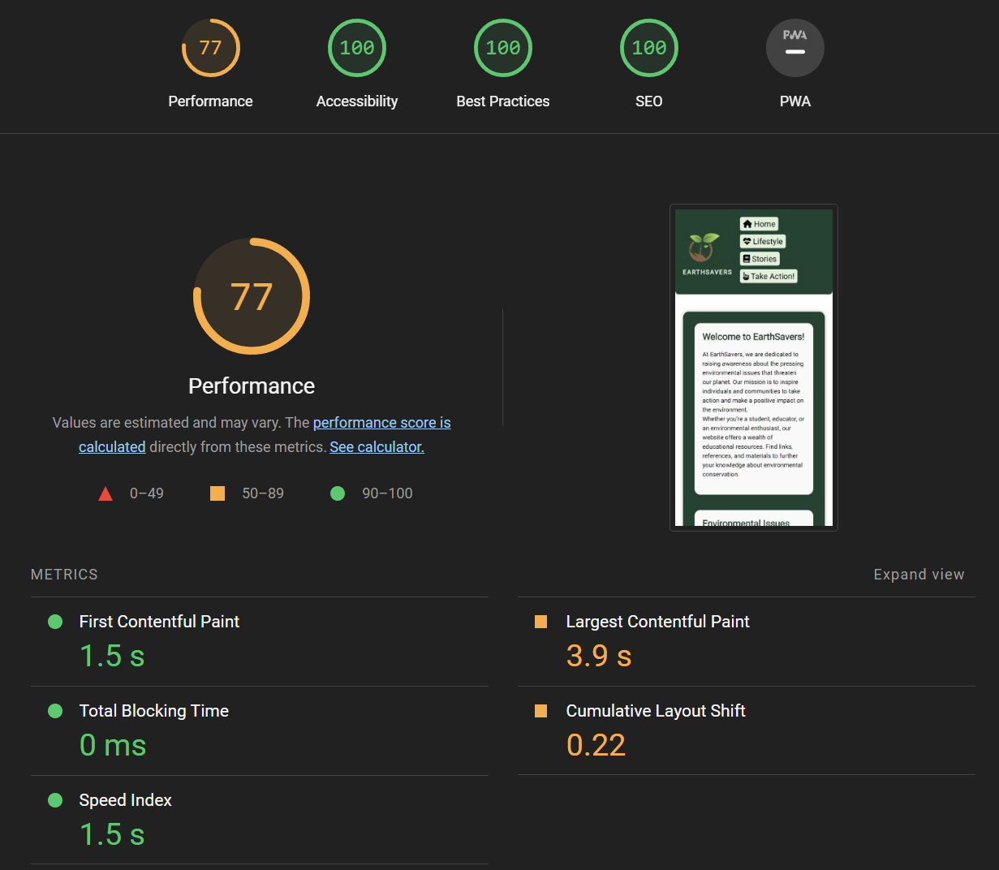
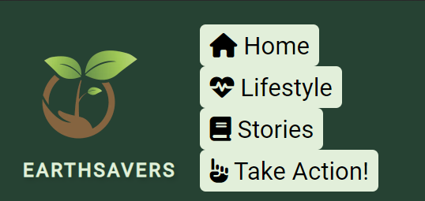
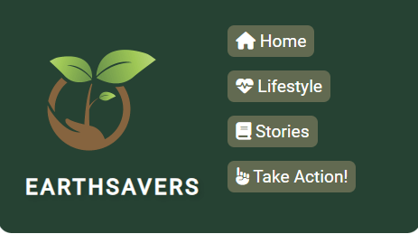

# EarthSavers

The EarthSavers website is intended to raise awareness about pressing environmental issues that threaten our planet and to inspire individuals and communities to take action and make a positive impact on the environment.

## The target audience

- **Environmental Enthusiasts:** For enthusiasts who care about the environment and want to stay informed about critical environmental challenges, this website provides valuable information and resources.

- **Students and Educators:** Teachers and students can find educational materials and insights into various environmental topics.

- **Community Activists:** For individuals and groups looking to get involved in environmental causes or seeking guidance on how to make a difference.

## Features

The EarthSavers website offers a range of features to help explore environmental issues and take action:

- **Informative Articles:** Visitors can access in-depth articles on critical environmental challenges, including climate change, deforestation, pollution, and biodiversity loss.

- **Inspiring Stories:** Visitors can discover stories of individuals and communities who have successfully taken action to protect our planet, providing inspiration for their own environmental efforts.

- **Take Action Form:** Users can fill out the Take Action form to express their interest in environmental action.

- **User-Friendly Design:** The website is created with a user-friendly design, making the navigation simple throughout the website's features.

- **Responsive Layout:** The layout is created so visitors can experience effortless browsing across a range of devices, such as desktop computers, tablets, and mobile phones.

## Design

- The colors have been set up to gain sufficient contrast on the website's appearance and to reflect the environmental topic.
- The following color codes were used on the website, they have been chosen to match the theme, and to ensure optimal contrast.

- To create a structured layout for the placement of elements throughout the website I utilized Figma's wireframing tool.
- For the structural planning, I used the dimensions of the iPhone 13 as my reference, following the mobile-first development approach.

  
## Footer

- The footer provides links to EarthSavers' social media profiles on Facebook, Twitter, YouTube, and Instagram.
  
- _blank property were used on the social media buttons, so they all open in a new tab after clicking, to prevent disruptive behavior from the website.
  
## External Resources

- The webpage uses the Font Awesome icon library for improved transparency.
  
- The Font Awesome icons were used:
  
1. On the header buttons

2. As unique bullet points in the descriptions next the buttons directing visitors to external links related to the relevant topics

3. On social media icons in the footer

## Stylesheet

- The page includes an external stylesheet (`style.css`) to control the visual layout and styling of the webpage.

## Favicon

- The webpage includes a favicon to display a custom icon in the browser tab.
  
- The favicon is the same one that was used as the main logo positioned at the start of the header section.
  
## Credits

- All images used in this project were free-to-use stock photos downloaded from pixabay.com and pexels.com.

- All the placed images were converted to .webp format and compressed further with TinyPNG to optimize them.

## Testing

HTML validator - Tested on every page - Passed.

CSS validator - Passed.

#### Browsers

Website tested on desktop and mobile devices in the following browsers:

- Google Chrome
- Mozilla Firefox
- Safari

Every element appears correctly and every function works as intended.

## Google Lighthouse Report

### Desktop

### Mobile devices

[Known Issues](#known-issues)

- Buttons leading to external links have been tested on desktop and mobile interface as well, all open correctly in a new tab.

## EarthSavers Action Form ##

Description

The Take Action Form is designed to empower individuals to take action, if they're interested in participating in local environmental initiatives or supporting global conservation organizations.

How to Use

1. *Full Name*: Enter the full name in the "Full Name" field.

2. *Email Address*: Provide the email address in the "Email Address" field, to contact the participants about relevant infos.

3. *Phone Number*: Enter the phone number in the "Phone Number" field, this is for additional contact details.

4. *Location*: Specify the location in the "Location" field, to assess where the participants are interested about any upcoming events.

5. *Preferred Action Area*: Select the preferred area of environmental action from the dropdown menu under "Preferred action area." They can choose from options "Community Cleanup," "Reforestation," "Wildlife Conservation," or "Environmental Advocacy", which are the main environmental action areas mentioned on the website.

6. *Frequency*: Indicate how often they are willing to participate. They have to select one of the following options:
   - [x] One-Time
   - [ ] Weekly
   - [ ] Monthly
   - [ ] Quarterly

7. *Availability*: Choose their availability for environmental action. Also required.
   - [x] Weekdays 
   - [ ] Weekends
   - [ ] Weekdays and Weekends

8. *Preferred Transportation*: Select the preferred mode of transportation for environmental activities.
   - [ ] Carpool
   - [ ] Public Transport

9. *Comments/Message*: For sharing any additional comments or messages.

10. Click the "Submit" button to submit your form.

11. After clicking the submit button, participants are redirected to the "Thank you" page.

### Testing

To ensure that the form functions correctly, I have tested the following scenarios:

- All required fields are filled out correctly.
- Responsibility testing on smaller devices, all the lines are clipping correctly and not expanding their container's width on any viewport size.
- Submitting the form with missing required fields to verify that error messages are displayed.

## Fixed Bugs

- In certain viewport sizes the navbar buttons were hiding each other when they clipped into new lines.

- By adding some margin on the bottom with CSS the navbar buttons now appear nicely organized on smaller screens too.

- There were no submit confirmation page included on the website, so I added a "Thank you" page for improved user experience.

## Known Issues

- After running the Google Lighthouse testing on the pages, the result is still showing lower performance score, due to "not properly sized images"
- After many resizing and conversion attempts, the images now appear sharp, they are all responsive and their file sizes are relatively small, but I still couldn't achieve higher score above the current value in Lighthouse.
- This issue could require further improvements on the responsive images.

## 404 Page ##

The project contains a 404 error page, that follows the website's overall design, and makes it easy for the users to navigate back to the Home page.

## Acknowledgements

I'd like to express my gratitude to Graeme Taylor, my mentor, for helping me get through my first milestone project work, by his excellent guidance and support.
