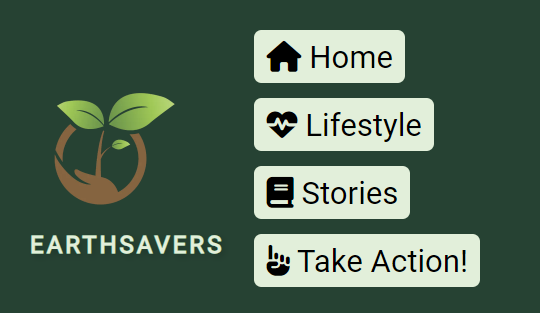

# EarthSavers

The EarthSavers website is intended to raise awareness about pressing environmental issues that threaten our planet and to inspire individuals and communities to take action and make a positive impact on the environment.

## The target audience

- **Environmental Enthusiasts:** For enthusiasts who care about the environment and want to stay informed about critical environmental challenges, this website provides valuable information and resources.

- **Students and Educators:** Teachers and students can find educational materials and insights into various environmental topics.

- **Community Activists:** For individuals and groups looking to get involved in environmental causes or seeking guidance on how to make a difference.

## Features

The EarthSavers website offers a range of features to help explore environmental issues and take action:

- **Informative Articles:** Visitors can access in-depth articles on critical environmental challenges, including climate change, deforestation, pollution, and biodiversity loss.

- **Inspiring Stories:** Visitors can discover stories of individuals and communities who have successfully taken action to protect our planet, providing inspiration for their own environmental efforts.

- **User-Friendly Design:** The website is created with a user-friendly design, making the navigation simple throughout the website's features.

- **Responsive Layout:** The layout is created so visitors can experience effortless browsing across a range of devices, such as desktop computers, tablets, and mobile phones.

## Take Action Form

- This page includes a form that users can fill out to express their interest in environmental action.
  
- The form includes fields for the user's full name, email address, phone number, location, preferred action area, frequency of participation, availability, preferred transportation, and a comments/message box to provide option for addig any more relevant information.
  
- Users can select their preferred action area from a dropdown menu and specify their frequency, availability, and transportation preferences.
  
- The form ends with a "Submit" button for users to submit their information.
  
- In the HTML code "required" properties were used, to prevent users submitting empty or incomplete forms.

## Footer

- The footer provides links to EarthSavers' social media profiles on Facebook, Twitter, YouTube, and Instagram.
  
- _blank property were used on the social media buttons, so they all open in a new tab after clicking, to prevent disruptive behavior from the website.
  
## External Resources

- The webpage uses the Font Awesome icon library to improve transparency.
  
- The Font Awesome icons were used:
  
1. On the header buttons
   
2. As custom bullet points in the descriptions next the buttons directing visitors to external links related to the relevant topics

3. On social media icons in the footer

## Stylesheet

- The page includes an external stylesheet (`style.css`) to control the visual layout and styling of the webpage.

## Favicon

- The webpage includes a favicon to display a custom icon in the browser tab.
  
- The favicon is the same one that was used as the main logo positioned at the start of the header section.
  
## Credits

- All images used in this project were free-to-use stock photos downloaded from pixabay.com and pexels.com.

- All the placed images were converted to .webp format and compressed further with TinyPNG to 

## Testing

CSS validator - Passed.

- EarthSavers Action Form

Description

The Take Action Form is designed to empower individuals to take action, if they're interested in participating in local environmental initiatives or supporting global conservation organizations.

How to Use

1. *Full Name*: Enter the full name in the "Full Name" field.

2. *Email Address*: Provide the email address in the "Email Address" field, to contact the participants about relevant infos.

3. *Phone Number*: Enter the phone number in the "Phone Number" field, this is for additional contact details.

4. *Location*: Specify the location in the "Location" field, to assess where the participants are interested about any upcoming events.

5. *Preferred Action Area*: Select the preferred area of environmental action from the dropdown menu under "Preferred action area." They can choose from options "Community Cleanup," "Reforestation," "Wildlife Conservation," or "Environmental Advocacy", which are the main environmental action areas mentioned on the website.

6. *Frequency*: Indicate how often they are willing to participate. They have to select one of the following options:
   - [x] One-Time
   - [ ] Weekly
   - [ ] Monthly
   - [ ] Quarterly

7. *Availability*: Choose their availability for environmental action. Also required.
   - [x] Weekdays 
   - [ ] Weekends
   - [ ] Weekdays and Weekends

8. *Preferred Transportation*: Select the preferred mode of transportation for environmental activities.
   - [ ] Carpool
   - [ ] Public Transport

9. *Comments/Message*: For sharing any additional comments or messages.

10. Click the "Submit" button to submit your form.

11. After clicking the submit button, participants are redirected to the "Thank you" page.

- Testing

To ensure that the form functions correctly, I have tested the following scenarios:

- All required fields are filled out correctly.
- Submitting the form with missing required fields to verify that error messages are displayed.

## Fixed bugs

- In certain viewport sizes the navbar buttons were hiding each other when they clipped into new lines.

- By simply adding some margin on the bottom with CSS the navbar buttons now appear nicely organized on smaller screens too.

- There were no submit confirmation page included on the website, so whenever the user submitted the form, they were directed to an error page.
  
## Acknowledgements

- I'd like to express my gratitude to Graeme Taylor, my mentor, by helping me get through my first milestone project work, by his excellent guidance and support.
